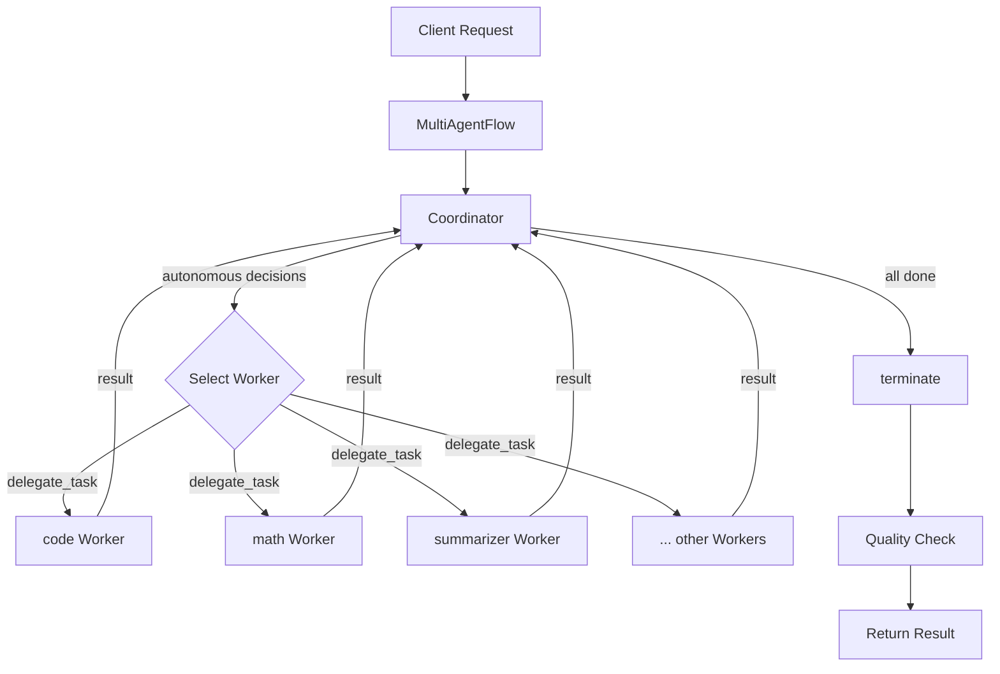

```mermaid
flowchart TD
    A[Client Request] --> B[MultiAgentFlow]
    B --> C[Coordinator]
    C -->|"autonomous decisions"| D{Select Worker}
    D -->|delegate_task| E[code Worker]
    D -->|delegate_task| F[math Worker]
    D -->|delegate_task| G[summarizer Worker]
    D -->|delegate_task| H["... other Workers"]
    E -->|result| C
    F -->|result| C
    G -->|result| C
    H -->|result| C
    C -->|"all done"| I[terminate]
    I --> J[Quality Check]
    J --> K[Return Result]
```
