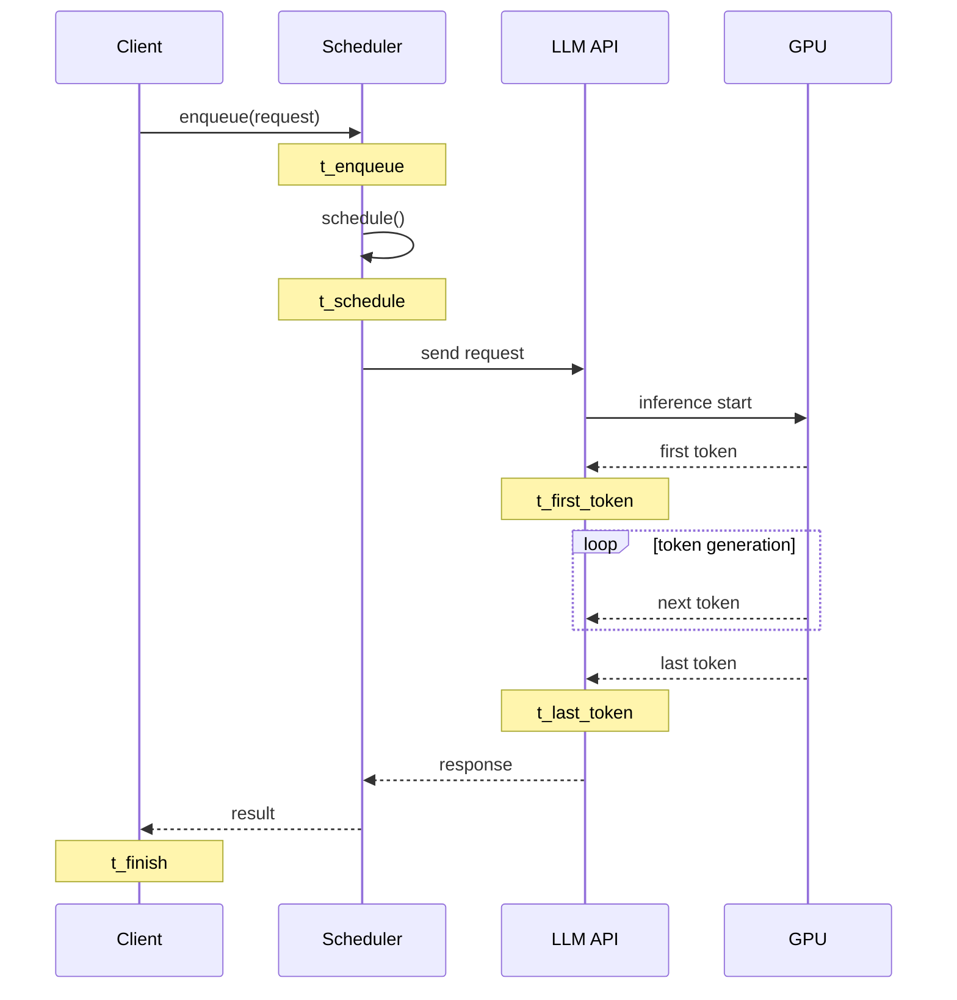

```mermaid
sequenceDiagram
    participant C as Client
    participant S as Scheduler
    participant L as LLM API
    participant G as GPU

    C->>S: enqueue(request)
    Note over S: t_enqueue
    S->>S: schedule()
    Note over S: t_schedule
    S->>L: send request
    L->>G: inference start
    G-->>L: first token
    Note over L: t_first_token
    loop token generation
        G-->>L: next token
    end
    G-->>L: last token
    Note over L: t_last_token
    L-->>S: response
    S-->>C: result
    Note over C: t_finish
```
